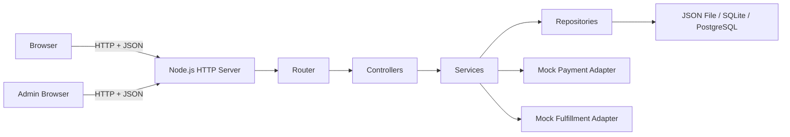

A real-money top-up platform is too risky for an initial JavaScript project. The strongest approach is to build a **complete transaction simulator** first: catalog, checkout, order lifecycle, mock payment, mock game-provider fulfillment, administration, testing, and deployment. Real integrations come only after the team understands the full flow.

# Product Requirements Document

## Game Top-Up Learning Platform

**Document version:** 0.1
**Project type:** Full-stack learning project
**Team size:** Two developers
**Primary objective:** Build practical frontend, backend, database, API, security, testing, and collaboration experience using native JavaScript and Node.js before adopting application frameworks.

---

## 1. Product Summary

The Game Top-Up Learning Platform is a responsive web application where customers can:

1. Select a game.
2. Choose a top-up product.
3. Enter their game account information.
4. Create an order.
5. Complete a simulated payment.
6. Track the order until the simulated top-up is delivered.

Administrators can manage games, products, pricing, and orders.

The first release will not process real money or connect to a real game top-up provider. Payment and fulfillment will be implemented through internal mock services that behave like external integrations.

---

## 2. Product Decision

### Recommended approach

Build the product in three maturity levels:

**Level 1 — Native learning implementation**

* HTML and CSS.
* Browser JavaScript.
* DOM APIs.
* ES modules.
* Fetch API.
* Node.js core HTTP server.
* In-memory and JSON-file persistence.
* Mock payment and fulfillment services.

**Level 2 — Structured native implementation**

* Modular frontend and backend.
* SQLite or PostgreSQL.
* Repository and service layers.
* Authentication and authorization.
* Automated tests.
* Deployment.

**Level 3 — Framework migration**

After the native implementation is understood and documented:

* Replace the custom backend router with a backend framework.
* Replace manual frontend rendering with a frontend framework where justified.
* Compare complexity, maintainability, performance, and developer experience.

The framework version should be a migration exercise, not a rewrite performed because the native version became disorganized.

---

## 3. Assumptions

* The main objective is learning rather than immediately launching a commercial business.
* The initial currency is Indonesian rupiah.
* The application supports customers, guests, administrators, and operational users.
* Customer registration is optional for the first MVP.
* The first version supports a small catalog of manually configured games.
* Payment and top-up fulfillment are simulated.
* The system is developed by two people using Git and pull requests.
* The application must work on desktop and mobile browsers.

---

## 4. Goals

### Product goals

* Allow a customer to complete an end-to-end simulated game top-up transaction.
* Provide clear order tracking and transaction status.
* Give administrators control over games, products, prices, and orders.
* Model payment and fulfillment as separate processes.
* Produce a system that can later integrate with real external providers.

### Learning goals

Both developers should be able to explain and implement:

* JavaScript variables, functions, objects, arrays, classes, and modules.
* DOM selection, event handling, rendering, and form management.
* Promises, `async`/`await`, Fetch, and error handling.
* HTTP methods, headers, status codes, request bodies, and JSON responses.
* Node.js modules and asynchronous programming.
* Routing, controllers, services, repositories, and validation.
* Database relationships and transactions.
* Authentication, authorization, cookies, and password storage.
* Unit, integration, and end-to-end testing.
* Git branching, pull requests, conflict resolution, and code review.

---

## 5. Non-Goals for the Initial MVP

The initial MVP will not include:

* Real payment processing.
* Real game-provider APIs.
* Automatic refunds.
* Promotional vouchers.
* Loyalty points.
* Multi-currency support.
* Multiple merchants or tenants.
* Native mobile applications.
* Marketplace sellers.
* Advanced fraud detection.
* High-availability infrastructure.
* Microservices.
* Kubernetes.
* Event streaming.
* Complex frontend state-management libraries.

These features would increase complexity without improving the initial JavaScript learning objective.

---

## 6. User Roles

### Guest Customer

Can:

* Browse available games.
* View top-up products.
* Create an order.
* Simulate payment.
* Track an order using an order code.

A guest does not need an account during the initial MVP.

### Registered Customer

Introduced after guest checkout is stable.

Can:

* Sign in.
* View order history.
* Save commonly used game accounts.
* Repeat a previous order.

### Administrator

Can:

* Sign in to the administration portal.
* Create and update games.
* Create and update top-up products.
* Enable or disable products.
* View all orders.
* Update permitted order statuses.
* Retry failed mock fulfillment.
* Review audit information.

### Operator

Optional role introduced after administrator functions work.

Can:

* View orders.
* Process or retry fulfillment.
* Handle failed transactions.

Cannot:

* Change administrator accounts.
* Change system configuration.
* Delete audit history.

---

## 7. Core User Journey

### Customer purchase flow

1. Customer opens the home page.
2. Customer selects a game.
3. System displays available top-up products.
4. Customer selects a product.
5. Customer enters the required account fields.
6. Customer enters an email address or phone number for order tracking.
7. Frontend validates the form for usability.
8. Backend validates all submitted values again.
9. Backend creates an order with status `PENDING_PAYMENT`.
10. System displays the order summary.
11. Customer selects “Simulate Successful Payment” or “Simulate Failed Payment.”
12. Successful payment changes the order to `PAID`.
13. Mock provider processes the top-up.
14. Successful fulfillment changes the order to `COMPLETED`.
15. Customer can view the complete status history.

### Order tracking flow

1. Customer enters an order code.
2. Backend retrieves the order.
3. System displays:

   * Game.
   * Product.
   * Account destination.
   * Amount.
   * Payment status.
   * Fulfillment status.
   * Order timeline.

Sensitive information must be partially masked.

---

## 8. MVP Functional Requirements

### FR-01: Game Catalog

The system shall allow customers to view active games.

Each game contains:

* ID.
* Name.
* Slug.
* Description.
* Image path.
* Required account fields.
* Active status.

Example account field definitions:

```json
[
  {
    "name": "userId",
    "label": "User ID",
    "type": "text",
    "required": true
  },
  {
    "name": "serverId",
    "label": "Server ID",
    "type": "text",
    "required": true
  }
]
```

The account-field configuration allows different games to request different information.

### FR-02: Product Catalog

Each game can contain multiple top-up products.

A product contains:

* ID.
* Game ID.
* Name.
* Description.
* Top-up amount.
* Selling price.
* Active status.
* Display order.

Money values must be stored as integers, not floating-point values.

Example:

```json
{
  "price": 15000,
  "currency": "IDR"
}
```

### FR-03: Checkout

The checkout form shall collect:

* Selected game.
* Selected product.
* Game account fields.
* Customer contact.
* Payment method simulation.
* Terms acceptance.

The backend must reject:

* Inactive games.
* Inactive products.
* Products that do not belong to the selected game.
* Missing account fields.
* Invalid contact information.
* Client-supplied prices.

The backend calculates the price from its own product data.

### FR-04: Order Creation

Each order shall receive:

* Internal ID.
* Public order code.
* Customer contact.
* Game snapshot.
* Product snapshot.
* Account destination.
* Price snapshot.
* Current status.
* Creation timestamp.
* Update timestamp.

Product and price snapshots prevent historical orders from changing when the catalog is updated.

### FR-05: Mock Payment

The project shall provide a mock payment adapter.

Supported outcomes:

* Successful payment.
* Failed payment.
* Expired payment.
* Duplicate callback.
* Delayed callback.

The mock payment flow must resemble a real payment gateway:

1. Create payment request.
2. Return payment reference.
3. Receive asynchronous callback.
4. Verify callback data.
5. Update payment.
6. Update order.

### FR-06: Mock Fulfillment

The project shall provide a mock game-provider adapter.

Supported outcomes:

* Immediate success.
* Delayed success.
* Failure.
* Timeout.
* Duplicate response.
* Retry success.

### FR-07: Order Tracking

Customers can retrieve an order using its public order code.

The public response shall not expose:

* Internal database IDs.
* Password hashes.
* Administrative notes.
* Provider credentials.
* Full sensitive account data.

### FR-08: Administration

Administrators can:

* List games.
* Create a game.
* Edit a game.
* Activate or deactivate a game.
* Manage products.
* View order details.
* Filter orders by status.
* Retry failed fulfillment.
* View the status timeline.

Hard deletion should not be supported for games or products that have existing orders. Deactivation is preferred.

### FR-09: Status History

Every status change must create a history record containing:

* Order ID.
* Previous status.
* New status.
* Reason.
* Actor type.
* Actor ID, when available.
* Timestamp.

---

## 9. Order State Model

Recommended order states:

```text
PENDING_PAYMENT
      |
      +---- payment failed ----> PAYMENT_FAILED
      |
      +---- payment expired ---> EXPIRED
      |
      +---- payment success ---> PAID
                                  |
                                  +---- fulfillment started ---> PROCESSING
                                                                   |
                                                                   +---- success ---> COMPLETED
                                                                   |
                                                                   +---- failure ---> FULFILLMENT_FAILED
```

Permitted transitions:

```text
PENDING_PAYMENT -> PAID
PENDING_PAYMENT -> PAYMENT_FAILED
PENDING_PAYMENT -> EXPIRED
PAID -> PROCESSING
PROCESSING -> COMPLETED
PROCESSING -> FULFILLMENT_FAILED
FULFILLMENT_FAILED -> PROCESSING
```

Invalid transitions must return an error.

For example:

```text
COMPLETED -> PENDING_PAYMENT
```

must never be accepted.

---

## 10. Suggested Data Model

### Game

```text
id
name
slug
description
image_path
account_field_schema
is_active
created_at
updated_at
```

### Product

```text
id
game_id
name
description
topup_value
price
currency
is_active
display_order
created_at
updated_at
```

### Order

```text
id
public_code
customer_id
customer_contact
game_id
game_name_snapshot
product_id
product_name_snapshot
price_snapshot
currency_snapshot
account_destination
status
created_at
updated_at
```

### Payment

```text
id
order_id
payment_reference
method
amount
status
provider_payload
paid_at
created_at
updated_at
```

### Fulfillment

```text
id
order_id
provider_reference
status
attempt_count
request_payload
response_payload
completed_at
created_at
updated_at
```

### OrderStatusHistory

```text
id
order_id
previous_status
new_status
reason
actor_type
actor_id
created_at
```

### AdminUser

```text
id
name
email
password_hash
role
is_active
created_at
updated_at
```

---

## 11. API Draft

Base path:

```text
/api/v1
```

### Public catalog

```http
GET /api/v1/games
GET /api/v1/games/:gameSlug
GET /api/v1/games/:gameSlug/products
```

### Orders

```http
POST /api/v1/orders
GET /api/v1/orders/:publicCode
```

Example order request:

```json
{
  "gameId": "game-mobile-legends",
  "productId": "product-86-diamonds",
  "account": {
    "userId": "12345678",
    "serverId": "1234"
  },
  "customer": {
    "contact": "customer@example.com"
  }
}
```

Example response:

```json
{
  "data": {
    "orderCode": "TOP-20260801-A7K2PX",
    "status": "PENDING_PAYMENT",
    "game": "Mobile Legends",
    "product": "86 Diamonds",
    "amount": 25000,
    "currency": "IDR"
  }
}
```

### Mock payment

```http
POST /api/v1/mock-payments
POST /api/v1/mock-payments/:paymentReference/succeed
POST /api/v1/mock-payments/:paymentReference/fail
POST /api/v1/mock-payments/:paymentReference/expire
```

### Mock fulfillment

```http
POST /api/v1/mock-fulfillments/:orderCode/process
POST /api/v1/mock-fulfillments/:orderCode/fail
POST /api/v1/mock-fulfillments/:orderCode/retry
```

### Administration

```http
POST   /api/v1/admin/sessions
DELETE /api/v1/admin/sessions

GET    /api/v1/admin/games
POST   /api/v1/admin/games
PATCH  /api/v1/admin/games/:id

GET    /api/v1/admin/products
POST   /api/v1/admin/products
PATCH  /api/v1/admin/products/:id

GET    /api/v1/admin/orders
GET    /api/v1/admin/orders/:id
POST   /api/v1/admin/orders/:id/retry-fulfillment
```

### Standard success envelope

```json
{
  "data": {},
  "meta": {}
}
```

### Standard error envelope

```json
{
  "error": {
    "code": "VALIDATION_ERROR",
    "message": "The submitted data is invalid.",
    "fields": {
      "account.userId": "User ID is required."
    }
  }
}
```

---

## 12. Native-First Technical Architecture



### Frontend

Use:

* Semantic HTML.
* CSS.
* JavaScript ES modules.
* DOM APIs.
* Fetch API.
* HTML Constraint Validation API.
* Custom client-side router only if a multi-page implementation becomes limiting.

Recommended first implementation:

```text
Multi-page application
```

Suggested pages:

```text
/
 /games/:slug
 /checkout
 /orders/:publicCode
 /admin/login
 /admin/games
 /admin/products
 /admin/orders
```

Do not begin by building a custom single-page application framework. A multi-page application provides enough frontend JavaScript practice without requiring manual recreation of an entire framework.

### Backend

Use Node.js core modules initially:

```text
node:http
node:url
node:crypto
node:fs/promises
node:path
node:test
node:assert/strict
```

Implement manually:

* HTTP server.
* Router.
* Route parameters.
* Query parameters.
* JSON request parser.
* Response helper.
* Error handling.
* Middleware chain.
* Static file serving.
* Request logging.
* Validation.
* Cookie parsing.
* Session lookup.

Do not attempt to manually implement:

* Password hashing algorithms.
* Encryption algorithms.
* TLS.
* Production database drivers.
* Payment cryptography.

Native-first means understanding application mechanics. It does not mean recreating security primitives.

Node’s core HTTP interface is intentionally low-level, which makes it appropriate for learning HTTP mechanics but costly to maintain for larger applications. ([Node.js][1])

---

## 13. Suggested Project Structure

```text
game-topup-platform/
├── client/
│   ├── assets/
│   ├── css/
│   │   ├── base.css
│   │   ├── components.css
│   │   └── pages.css
│   ├── js/
│   │   ├── api/
│   │   │   ├── api-client.js
│   │   │   ├── games-api.js
│   │   │   └── orders-api.js
│   │   ├── components/
│   │   ├── pages/
│   │   ├── utilities/
│   │   └── main.js
│   ├── index.html
│   ├── game.html
│   ├── checkout.html
│   └── order.html
│
├── server/
│   ├── config/
│   ├── controllers/
│   ├── errors/
│   ├── middleware/
│   ├── repositories/
│   ├── routes/
│   ├── services/
│   ├── integrations/
│   │   ├── payment/
│   │   └── fulfillment/
│   ├── validators/
│   ├── utilities/
│   ├── app.js
│   └── server.js
│
├── data/
│   ├── games.json
│   ├── products.json
│   └── orders.json
│
├── tests/
│   ├── unit/
│   ├── integration/
│   └── fixtures/
│
├── docs/
│   ├── prd.md
│   ├── api.md
│   ├── architecture.md
│   └── decisions/
│
├── .env.example
├── .gitignore
├── package.json
└── README.md
```

ES modules should be used consistently in the browser and backend so the team learns explicit imports, exports, module boundaries, and dependency direction. ([MDN Web Docs][2])

---

## 14. Development Milestones

### Milestone 1: JavaScript Storefront

Build:

* Static game catalog.
* Product selection.
* Checkout form.
* Order summary.
* Responsive layout.

Data can initially come from local JavaScript objects.

Learning focus:

* Functions.
* Arrays and objects.
* Array methods.
* DOM rendering.
* Events.
* Form handling.
* ES modules.

Completion condition:

The customer can select a game and product and produce a valid JavaScript order object without a backend.

### Milestone 2: Native Node.js API

Build:

* Node HTTP server.
* Manual router.
* JSON request parsing.
* Catalog endpoints.
* Order creation endpoint.
* Central error handler.

Learning focus:

* HTTP.
* Node.js runtime.
* Request-response lifecycle.
* Asynchronous code.
* Status codes.
* JSON serialization.
* Layer separation.

Completion condition:

The frontend retrieves games through Fetch and creates an order through the API.

The Fetch API is promise-based, but a returned HTTP error such as `400` or `500` does not automatically reject the promise. The API client must explicitly inspect the response status. ([MDN Web Docs][3])

### Milestone 3: Persistence

Start with:

```text
In-memory repository
```

Then replace it with:

```text
JSON-file repository
```

Then introduce:

```text
SQLite or PostgreSQL repository
```

The service layer should not depend directly on the storage implementation.

Example interface:

```javascript
export class OrderRepository {
  async create(order) {
    throw new Error("Not implemented");
  }

  async findByPublicCode(publicCode) {
    throw new Error("Not implemented");
  }

  async updateStatus(id, status) {
    throw new Error("Not implemented");
  }
}
```

Completion condition:

Changing repositories does not require changing controllers or frontend code.

### Milestone 4: Transaction Simulation

Build:

* Payment records.
* Mock payment callbacks.
* Fulfillment records.
* Retry behavior.
* Order state machine.
* Status history.
* Duplicate-callback protection.

Learning focus:

* Business workflows.
* State transitions.
* Idempotency.
* Failure handling.
* External-service abstraction.

Completion condition:

The system correctly handles successful, failed, delayed, and duplicated payment and fulfillment events.

### Milestone 5: Administration and Authentication

Build:

* Administrator login.
* Server-side session.
* Game management.
* Product management.
* Order management.
* Authorization checks.

Do not store session identifiers in browser `localStorage`. OWASP notes that local-storage data is accessible to JavaScript, while session cookies can be protected using attributes such as `HttpOnly`, `Secure`, and `SameSite`. ([OWASP Cheat Sheet Series][4])

Passwords must never be stored in plain text. Use a maintained password-hashing implementation rather than designing a custom algorithm. ([OWASP Cheat Sheet Series][5])

### Milestone 6: Testing and Hardening

Use Node’s built-in test runner and assertion modules before introducing a larger testing framework. The built-in test runner supports synchronous, promise-based, and callback-based tests. ([Node.js][6])

Test:

* Price calculation.
* Account-field validation.
* Order-code generation.
* Status transitions.
* Payment callback duplication.
* Repository behavior.
* HTTP endpoints.
* Authorization.
* Invalid request bodies.
* Missing records.
* Concurrent update attempts.

Completion condition:

Core business rules are covered by automated tests and can be run with one command.

---

## 15. Validation Rules

Client-side validation improves user experience, but server-side validation remains authoritative. Client requests can be modified or sent without using the official frontend. ([MDN Web Docs][7])

Validate:

* Data type.
* Required fields.
* Minimum and maximum length.
* Allowed characters.
* Enumerated values.
* Numeric boundaries.
* Object properties.
* Unknown properties.
* Product ownership.
* Product active status.
* Order status transitions.

Example rule:

```javascript
const allowedOrderFields = [
  "gameId",
  "productId",
  "account",
  "customer"
];
```

Reject unexpected sensitive fields such as:

```json
{
  "price": 1,
  "status": "COMPLETED",
  "isAdmin": true
}
```

---

## 16. Security Requirements

### SEC-01: Authorization

Every administrator endpoint must verify:

1. The requester has an authenticated session.
2. The user is active.
3. The role permits the action.
4. The user is permitted to access the requested object.

Broken object-level and function-level authorization are major API risks, so authorization must be enforced in the backend rather than hidden only in the interface. ([OWASP Developer Guide][8])

### SEC-02: Session Security

Production cookies must use appropriate settings:

```text
HttpOnly
Secure
SameSite
```

Sessions must be invalidated after:

* Logout.
* Password change.
* Account deactivation.
* Role change.

### SEC-03: Sensitive Data

Do not log:

* Passwords.
* Session tokens.
* Payment credentials.
* Full game-account identifiers.
* Environment secrets.

### SEC-04: Input and Output Control

* Validate all incoming request bodies.
* Return only explicitly permitted response properties.
* Do not return raw database objects.
* Do not expose stack traces in production responses.
* Limit request-body sizes.

### SEC-05: External Integrations

Future payment and top-up APIs must be treated as untrusted systems.

The application must:

* Verify callback signatures.
* Validate response schemas.
* Use request timeouts.
* Limit retries.
* prevent duplicate processing.
* Log provider reference IDs.
* Handle provider downtime.

OWASP identifies unsafe consumption of third-party APIs as a distinct API security risk. ([OWASP][9])

---

## 17. Non-Functional Requirements

### Usability

* Responsive from approximately 360-pixel mobile width upward.
* Checkout should show progress clearly.
* Errors must identify the affected field.
* Order status must use both text and visual indicators.
* Pages must remain usable with keyboard navigation.

### Performance

For the learning MVP:

* Catalog responses should remain small.
* Images should be compressed.
* Repeated catalog data may be cached in the browser.
* Pagination should be added to administration order lists.

No artificial high-scale target is required initially.

### Reliability

* Duplicate payment callbacks must not create duplicate payments.
* Duplicate fulfillment callbacks must not deliver twice.
* Invalid status transitions must be rejected.
* Data writes must not silently fail.
* External mock services must support deterministic failure scenarios.

### Maintainability

* Business logic must not reside in route definitions.
* Database calls must not reside in frontend code.
* Controllers must remain thin.
* Services must own business rules.
* Repositories must own persistence.
* External integrations must be accessed through adapters.

---

## 18. Team Collaboration Model

Both developers should work across frontend and backend rather than permanently dividing roles.

Recommended rotation:

### Feature A

* Developer 1: frontend owner.
* Developer 2: backend owner.

### Feature B

* Developer 2: frontend owner.
* Developer 1: backend owner.

For every feature:

1. Create an issue.
2. Define acceptance criteria.
3. Create a branch.
4. Implement the feature.
5. Add tests.
6. Open a pull request.
7. The other developer reviews it.
8. Resolve comments.
9. Merge after validation.

Suggested branch naming:

```text
feature/game-catalog
feature/order-creation
fix/duplicate-payment
refactor/order-service
docs/api-contract
```

Pull requests should explain:

* What changed.
* Why it changed.
* How it was tested.
* Known limitations.
* Screenshots for interface changes.
* API examples for backend changes.

Do not allow each person to work permanently in an isolated frontend or backend repository. That would weaken the full-stack learning objective.

---

## 19. Definition of Done

A feature is complete only when:

* Acceptance criteria are satisfied.
* Input validation is implemented.
* Errors are handled.
* Tests pass.
* No secrets are committed.
* Code has been reviewed by the other developer.
* Documentation is updated.
* The feature works from the browser through the backend and persistence layer.
* Failure behavior has been tested, not only the successful path.

---

## 20. MVP Acceptance Criteria

The MVP is accepted when:

1. Customers can browse at least three games.
2. Each game has at least three top-up products.
3. Different games can require different account fields.
4. Customers can create an order.
5. Prices are calculated by the backend.
6. Customers can simulate successful and failed payments.
7. Paid orders can be processed by the mock fulfillment provider.
8. Failed fulfillment can be retried.
9. Customers can track orders through a public code.
10. Administrators can manage games and products.
11. Administrators can view and filter orders.
12. Invalid order-state transitions are rejected.
13. Duplicate callbacks do not create duplicate processing.
14. Core business rules have automated tests.
15. Both developers can explain the complete request flow from browser to database.

---

## 21. Post-MVP Backlog

After the native MVP is stable:

* Customer accounts.
* Saved game identities.
* Order history.
* Email notifications.
* Promotional codes.
* Product search.
* Admin audit log.
* Database migrations.
* OpenAPI specification.
* Docker development environment.
* CI pipeline.
* Real payment sandbox.
* Real game-provider sandbox.
* Rate limiting.
* Observability.
* Framework migration comparison.

---

## 22. Framework Adoption Criteria

A framework may be introduced when the team can identify a concrete problem it solves.

Examples:

* Repeated routing boilerplate.
* Complex middleware composition.
* Difficult response handling.
* Large frontend state synchronization.
* Repeated DOM rendering.
* Complex navigation.
* Form-state duplication.
* Component reuse requirements.

Before migration, document:

```text
Problem
Current native implementation
Framework capability
Migration cost
Expected improvement
New abstraction introduced
```

The objective is not to avoid frameworks indefinitely. The objective is to understand the problems that frameworks solve before depending on them.

---

## 23. Final Recommendation

Begin with this scope:

```text
Guest checkout
Three games
Three products per game
Native multi-page frontend
Native Node.js HTTP API
In-memory repository
Mock payment
Mock fulfillment
Order tracking
Automated business-rule tests
```

Do not include administrator authentication, customer accounts, real databases, or real external integrations in the first working vertical slice.

The first delivery target should be one complete journey:

```text
Game selection
→ product selection
→ account input
→ order creation
→ mock payment
→ mock fulfillment
→ order completion
```

Once that journey works, improve architecture and replace temporary components incrementally.

The key design decision is the **vertical slice**: finish one realistic transaction end to end before expanding the catalog, authentication, administration, or infrastructure. This prevents the project from becoming a collection of disconnected tutorials.****

[1]: https://nodejs.org/api/http.html?utm_source=chatgpt.com "HTTP | Node.js v26.5.0 Documentation"
[2]: https://developer.mozilla.org/en-US/docs/Web/JavaScript/Guide/Modules?utm_source=chatgpt.com "JavaScript modules - JavaScript | MDN"
[3]: https://developer.mozilla.org/en-US/docs/Web/API/Fetch_API?utm_source=chatgpt.com "Fetch API - Web APIs | MDN"
[4]: https://cheatsheetseries.owasp.org/cheatsheets/Session_Management_Cheat_Sheet.html?utm_source=chatgpt.com "Session Management - OWASP Cheat Sheet Series"
[5]: https://cheatsheetseries.owasp.org/cheatsheets/Password_Storage_Cheat_Sheet.html?utm_source=chatgpt.com "Password Storage - OWASP Cheat Sheet Series"
[6]: https://nodejs.org/api/test.html?utm_source=chatgpt.com "Test runner | Node.js v26.5.0 Documentation"
[7]: https://developer.mozilla.org/en-US/docs/Learn_web_development/Extensions/Forms/Form_validation?utm_source=chatgpt.com "Client-side form validation - Learn web development | MDN"
[8]: https://devguide.owasp.org/en/07-training-education/07-api-top-ten/?utm_source=chatgpt.com "API Top 10 - OWASP Developer Guide"
[9]: https://owasp.org/API-Security/editions/2023/en/0xaa-unsafe-consumption-of-apis/?utm_source=chatgpt.com "API10:2023 Unsafe Consumption of APIs - OWASP API Security Top 10"
